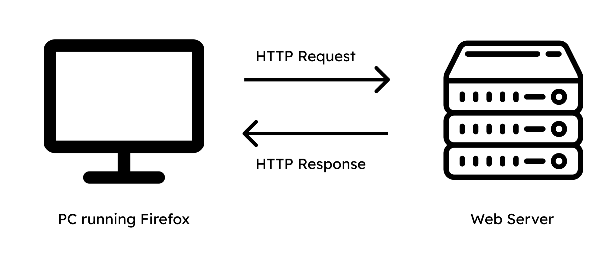

# The Web and HTTP

As we discuss the Web and HTTP, remember that web pages consist of **objects**, each of which can be stored on different servers. This object can be an HTML file, JPEG image, Java applet, audio file, etc. 

##  HTTP Overview

**HTTP: Hypertext transfer protocol**

HTTP is the Web's application layer protocol. It uses a client-server model. A client could be a web browser like firefox or safari, or it might be embedded in the device. The server sends objects in response to requests.

Take for instance a PC running Firefox. The client (Firefox) will send a kind HTTP request to the Web server. The Web server afterwards, if the world is at peace, will send back an HTTP response.

 

 

HTTP uses the transport services provided by the **TCP** protocol. The client will open a TCP connection to a web server (creating a socket) using port 80. The server accepts the TCP connection, the client and server will exchange messages, and then the TCP connection will close.

HTTP is a *stateless* protocol. This means that it doesn't have any information about past client requests. There's a single request, and a single response. You might wonder why it's stateless, and its because of its simplicity. Protocols that have to think of states will be more complex - needing to think about cleanup in the 
case that the transaction fails.

## HTTP connections: two types

### Non-persistent HTTP

In a non-persistent HTTP connection, a TCP connection is opened and at most one object is sent over the TCP connection. Then, it closes. This means that downloading multiple objects requires multiple TCP connections.

### Example 

 

 

In this annotated example, we see that the Client starts off with a request to have a TCP connection at port 80. The server is waiting for a TCP connection, and will receive it. It accepts the request, and then notifies the client.

The client requests an object that contains the url, and this goes into the TCP connection socket. The server will receive the message, and then the server sends the object (containing the html file) into the TCP connection socket for the client. Thus ending the TCP connection.

This process will recursively occur until all the images are found. 

## Non-persistent HTTP response time

 

 

Let's define **RTT** (round trip time) as the time it takes for a small packet to travel from the client to the server and back. 
We would say that the non-persistent HTTP response time is **2RTT + file transmission time**.

### Persistent HTTP

There are a few issues with non-persistent HTTP. 

- Requires 2 RTTs per object
- OS overhead for each TCP connection
- Browsers often open multiple parallel TCP connections to fetch referenced objects in parallel.

In a persistent HTTP connection, a TCP connection is opened and multiple objects can be sent over this single TCP connection. Afterwards, the TCP connection closes.

This means:

- The server leaves a connection open after sending response
- Subsequent HTTP messages between same server/client sent over open connection
- Client sends requests as soon as it encounters a referenced object
- One RTT for all the referenced objects

