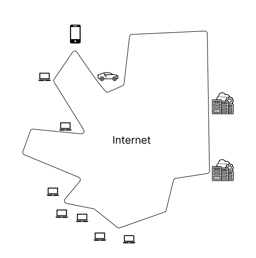
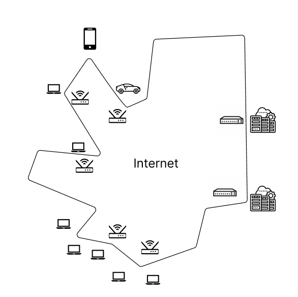
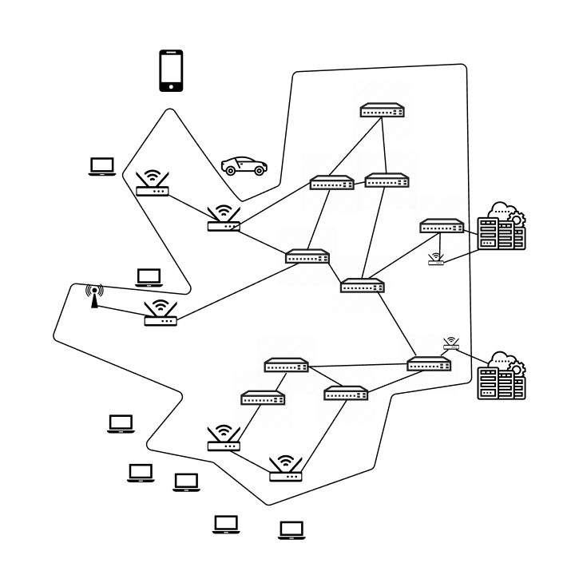
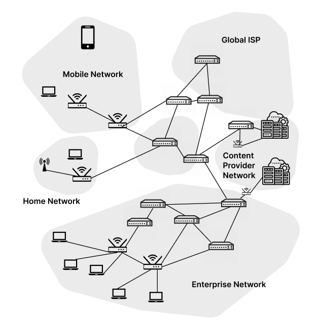

# The internet

## The internet: a "nuts and bolts" view

Let's look at the edge of the internet.

 

import Image from 'next/image'

If you imagine that the internet is some kind of close shaped, you will find that it has edges.  At the edge of the internet, we can see all kinds of devices sticking out: personal computers, laptops, cars, smartphones, datacenters - the variety of devices are limitless. The number of devices that are connected to the internet
is in the order of *billions*. We call these devices **hosts** or end systems (because they're at the *edge* of the network). 

 

 

Going deeper, we find the devices that actually create the network are known as **packet switches**. A **packet** is a chunk of data, and packet switches will forward packets between hosts and devices. There are two types of packet switches: **routers** and **switches**. We will learn more about these. 

 

We also have the numerous **communication links** that connect the routers, switches, hosts, and systems. That might take the form of fiber, copper, radio, or satellite.

Finally, these communication links, routers, switches, and hosts are assembled into networks each of which is run by something or someone. For instance, your home network is connected to a local ISP (Internet Service Provider), which might be connected to a national/global ISP. These **networks** are a collection of devices, routers, and linked managed by an organization.

 

 

The fact there are all these networks gives rise to the saying that the internet is a "network of networks". 