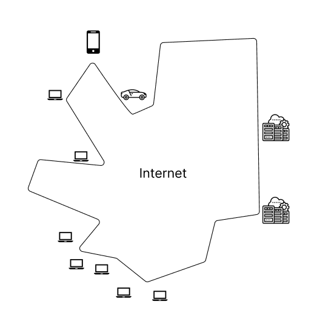
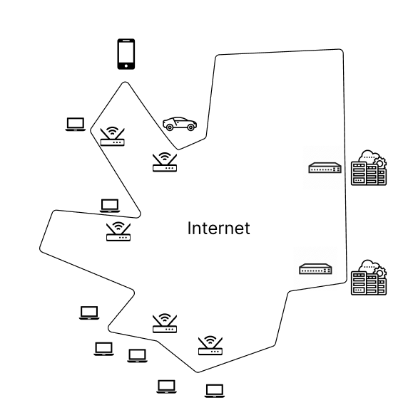

# Protocols

## What is a protocol?

Maybe the easiest way to visualize protocols is to think about human protocols first. Humans execute protocols all the time:

- A human asks, "What's the time?" 

In this protocol, a person asks for the time, and someone else responds with the time. Here, we see that there is a **request** and there's a **reply**.

- A professor asks, "Are there any questions?" 

In this protocol, if a student doesn't have a question, then they might stare sullenly at their desk or stare at the ceiling. If a student does have a question, they will raise their hand and ask the question, and the professor will send a response. This is a multi-step human protocol. 

Can you think of any other protocols?

The anatomy of these human protocols consist of specific messages being sent, and then specific actions being taken when a message is received, or some other event.

### Network Protocols

It turns out that network protocols are analogous to human protocols. In a human protocol, there are phases like the greeting phase (saying hi to each other), the request phase (what time is it?), and the response phase (2pm).

And shortly, we'll see that network protocols function similarly: there's a connection request phase, followed by a request-response phase.

With this, we can come up with a pretty decent definition of a **protocol**. 

import Bleed from 'nextra-theme-docs/bleed'

 

<Bleed>
  

    **Protocols** define the **format**, **order**, of **messages sent and received** among network entities, and **actions taken** on msg transmission, receipt.
  

</Bleed>

## The internet: a "nuts and bolts" view

Let's look at the edge of the internet.

 

import Image from 'next/image'

If you imagine that the internet is some kind of close shaped, you will find that it has edges.  At the edge of the internet, we can see all kinds of devices sticking out: personal computers, laptops, cars, smartphones, datacenters - the variety of devices are limitless. The number of devices that are connected to the internet
is in the order of *billions*. We call these devices **hosts** or end systems (because they're at the *edge* of the network). 

 

 

Going deeper, we find the devices that actually create the network are known as **packet switches**. A **packet** is a chunk of data, and packet switches will forward packets between hosts and devices. There are two types of packet switches: **routers** and **switches**. We will learn more about these. 

 

We also have the numerous **communication links** that connect the routers, switches, hosts, and systems. That might take the form of fiber, copper, radio, or satellite.

Finally, these communication links, routers, switches, and hosts are assembled into networks each of which is run by something or someone. For instance, your home network is connected to a local ISP (Internet Service Provider), which might be connected to a national/global ISP. These **networks** are a collection of devices, routers, and linked managed by an organization.

 

 

The fact there are all these networks gives rise to the saying that the internet is a "network of networks". 

As before stated before, the way we send and receive messages within these networks are controlled by **protocols**. Yes, they are everywhere.

## Knowledge check

**1.** Which of the following descriptions below correspond to a "nuts-and-bolts" view of the Internet? Select one or more of the answers below that are correct. [Hint: more than one of answers below are correct].

1. A platform for building network applications.
2. A "network of networks".
3. A collection of billions of computing devices, and packet switches interconnected by links.
4. A place I go for information, entertainment, and to communicate with people.
5. A collection of hardware and software components executing protocols that define the format and the order of messages exchanged between two or more communicating entities, as well as the actions taken on the transmission and/or receipt of a message or other event.

 
 Solution 
 
 2,3,5 
  

**2.** Which of the following descriptions below correspond to a "services" view of the Internet? Select one or more of the answers below below that are correct below that are correct.  [Hint: more than one of answers below are correct].

1. A platform for building network applications.
2. A "network of networks".
3. A collection of billions of computing devices, and packet switches interconnected by links.
4. A place I go for information, entertainment, and to communicate with people.
5. A collection of hardware and software components executing protocols that define the format and the order of messages exchanged between two or more communicating entities, as well as the actions taken on the transmission and/or receipt of a message or other event.

 
 Solution 
 
 1,4 
  

**3.** Which of the following human scenarios involve a protocol (recall: "Protocols define the format, order of messages sent and received among network entities, and actions taken on message transmission, receipt")? Select one or more answers below that are correct. Hint: more than one of answers below are correct.

1. A person sleeping.

2. A student raising her/his hand to ask a really insightful question, followed by the teaching acknowledging the student, listening carefully to the question, and responding with a clear, insightful answer.  And then thanking the student for the question, since teachers love to get questions.

3. A person reading a book.

4. Two people introducing themselves to each other.

5. One person asking, and getting, the time to/from another person.

 
 Solution 
 
 2,4,5 
  

